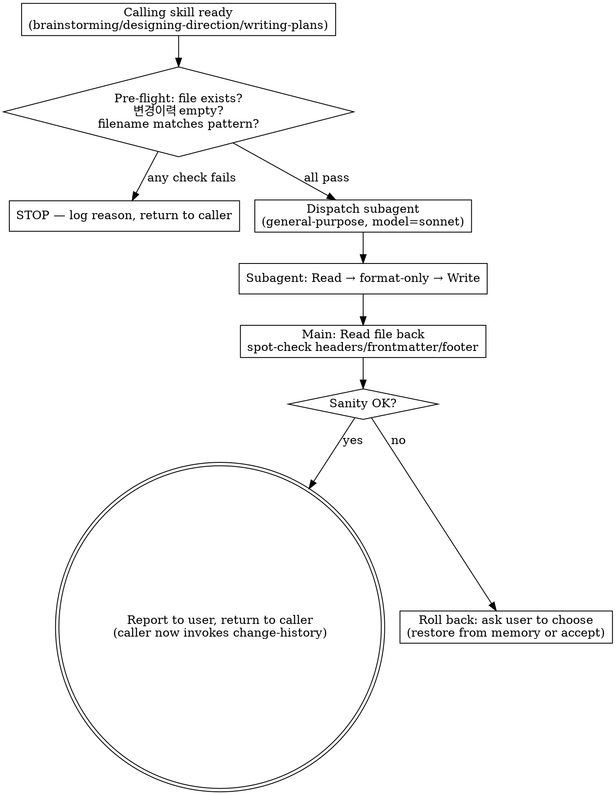

# Docs Pretty (Pre-Review Formatting)

This skill prettifies a freshly written or rewritten feature MD just before the user reviews it during the initial creation phase. It exists because the agent-authored draft is content-correct but visually noisy (inconsistent header levels, ad-hoc list bullets, unaligned tables, rough spacing). This pass tightens visual hierarchy WITHOUT touching meaning, so the user reviews a clean version. The user's review is the safety net: if the format pass ever drifts meaning, they catch it BEFORE it gets locked into change-history.

**Announce at start:** "I'm using the docs-pretty skill to format `<file>` before the user reviews it."

<HARD-GATE>
Trigger timing (v1.1.15+ 통일 — pre-review per-draft):

모든 doc 타입에서 동일하게 발화: 메인이 RAW 작성 → docs-pretty (사용자 리뷰 직전) → 사용자가 prettified 본문 검토 → 승인 → change-history. 사용자 fix 요청 시 메인이 in-memory raw 갱신 후 docs-pretty 재발화 (per-draft loop).

- **requirements.md** — brainstorming 흐름 끝, 사용자 리뷰 직전. user-fix 시 재발화.
- **tech-design.md** — designing-direction 흐름 끝, 사용자 리뷰 직전 (combined approval gate 와 결합). user-fix 시 재발화.
- **implementation-plan.md** — writing-plans 흐름 끝, verifying-spec + code-pretty 통과 후, 사용자 리뷰 직전. user-fix 시 재발화 (기존 패턴 유지).

STOPS firing the moment the first `change-history` entry has been logged. That boundary marks the doc as "live" — from then on, no docs-pretty.

Specifically, docs-pretty MUST NOT run on:
- Any user-requested edit AFTER the first change-history entry exists (partial revisions, fixes, additions)
- Any `change-history` entry append (the `## 변경이력` footer is the audit trail — never reformat it)
- Any `change-propagation` cascade
- Any in-task code-edit logging during `/execute-plan`

If you are unsure whether this is still in the "initial creation phase" — STOP. Look for an existing `## 변경이력` footer with one or more entries. If ANY entry exists, this is NOT initial creation. Skip this skill.
</HARD-GATE>

## When to Use

| Trigger (yes) | Anti-trigger (no) |
|---|---|
| `brainstorming` just wrote RAW `<slug>-requirements.md`, about to show to user for review, no entries yet | User asked to update FR-3 wording in an already-live requirements.md (one with change-history entries) |
| `designing-direction` just wrote RAW `<slug>-tech-design.md`, about to show combined approval gate (doc + verify report), no entries yet | `change-propagation` is cascading edits across MDs |
| `writing-plans` just completed verifying-spec + code-pretty on `<slug>-implementation-plan.md`, about to show prettified plan to user, no `## 변경이력` entries yet | `change-history` is appending a `[코드-수정]` entry mid-`/execute-plan` |
| `brainstorming` or `designing-direction` user requested fix on draft — revise RAW, re-fire docs-pretty (per-draft loop) | First change-history entry has been logged — doc is now "live", do NOT fire |
| `writing-plans` user requested revision, plan re-written, verifying-spec re-ran, code-pretty re-ran — fire docs-pretty again | (none for pre-review timing — docs-pretty now fires before every user review) |

## Why Two Subagents in Parallel (v2.2.0+)

Pretty-formatting + HTML companion generation is a pure transformation task — no domain reasoning, no decisions. Loading the full doc into the main agent context is wasteful, and the main agent's reasoning model is overkill.

**Always dispatch two subagents in parallel (one message, two Task tool calls), both with `model: "sonnet"`.** Reasoning:

1. The "절대 의미를 잃지 말라" constraint is the user's #1 priority. Sonnet's instruction-following is more reliable than Haiku at honoring negative constraints ("do NOT reword").
2. Per-feature cost is 3 dispatches × 2 subagents max — savings from Haiku are negligible vs. the risk of meaning drift.
3. Main context stays clean — neither the `.md` body nor the `.html` output lives in main memory.
4. A (`.md` format-only) and B (`.html` companion) are independent — parallel dispatch minimizes latency.
5. B (HTML companion) needs LLM-level judgment for visual heuristics (which table → Mermaid?) — Sonnet's reasoning is required.

Do NOT use Opus (overkill) or Haiku (rephrasing risk on Korean prose). Sonnet is the floor and ceiling for both A and B.

## Process

### Step 1 — Pre-flight check (v1.1.15+ user-gate)

Before dispatching, run the deterministic helper. **stderr 도 capture** — 실패 시 사용자에게 그대로 노출:

```bash
source .venv/bin/activate && python -c "
import sys
from pathlib import Path
from scripts.preflight import docs_pretty_check
result = docs_pretty_check(Path('<TARGET>'))
print(f'ok={result.ok} reason={result.reason} | {result.human_reason}')
sys.exit(0 if result.ok else 1)
" 2>&1
```

**exit code 분기 (v1.1.15 user-gate)**:

- **exit 0** → 검증 통과, Step 2 dispatch 진행.
- **exit 1** (helper semantic fail, ok=False) → `human_reason` 한 줄 노출 후 `AskUserQuestion` 게이트:
  - choices:
    - `"수정 후 재시도"` → 사용자가 doc 수정 후 메인이 helper 재호출.
    - `"강제 진행 (위험)"` → preflight 무시하고 Step 2 진입. 메인이 `⚠️ preflight 우회. <reason> 무시하고 진행.` 한 줄 안내.
    - `"스킵 (이번만)"` → docs-pretty 단계 스킵, caller 에게 abnormal return (caller 가 change-history 직행 결정).
- **exit ≠ 0,1** (invocation 실패: 127 / 2 / etc., harness 환경 이슈) → stderr 전문 노출 + `AskUserQuestion` 게이트:
  - 메시지: `"preflight helper invocation 실패 (exit <code>): <stderr 전문>. 어떻게 할까요?"`
  - choices:
    - `"직접 디버깅"` → 사용자가 환경 점검 (venv / python 경로 / `scripts/preflight.py` 존재) 후 알려주면 메인이 재호출.
    - `"skill 단계 스킵"` → preflight 우회하고 Step 2 진입 (위와 동일).

자세한 룰은 `scripts/preflight.py:docs_pretty_check`. helper 검사: file 존재 / 변경이력 footer 비어있음 / filename 패턴.

### Step 2 — Dispatch TWO subagents in parallel (v2.2.0+)

Use TWO `Agent` (or `Task`) tool calls in a single message (parallel). Both with `model: sonnet`.

**Subagent A — `.md` format-only pass (기존)**:
- `subagent_type`: `general-purpose`
- `model`: `sonnet`
- `description`: `Format-only pass on <filename>.md`
- `prompt`: see "Subagent A Prompt Template" below

**Subagent B — `.html` companion (신규)**:
- `subagent_type`: `general-purpose`
- `model`: `sonnet`
- `description`: `HTML companion for <filename>.md`
- `prompt`: load `skills/docs-pretty/html-companion-prompt.md`, fill `<ABSOLUTE_MD_PATH>` + `<ABSOLUTE_HTML_PATH>` (same dir, same basename, `.html` extension)

A and B are independent — B receives the RAW `.md` path (not prettified). D3 semantic-preservation rule means RAW and prettified are byte-equivalent at the meaning level.

### Step 3 — Verify and report (v2.2.0+ A + B reconcile)

After both subagents return:
1. Read `.md` back (1 Read for A's output)
2. Spot-check A: section headers count unchanged, frontmatter intact, `## 변경이력` footer intact (still empty), no obvious content loss
3. Read `.html` back (1 Read for B's output)
4. Spot-check B (semantic drift check):
   - `.html` 의 H1/H2/H3 헤더 개수 == `.md` 의 헤더 개수 (±0, strict)
   - `.html` 의 `<pre><code>` 개수 == `.md` 의 코드 블록 개수 (±0, strict)
   - `.html` 외부 URL 참조 0 (`grep -E "https?://" .html` → 0 결과)
   - sentence-level node 수 차이 5% 이내
5. Failure matrix (D-T7):
   - A 성공 / B 실패 → `.md` 만 갱신 + 사용자에게 "`.html` 생성 실패, 수동 retry 가능" 알림
   - A 실패 / B 성공 → 둘 다 폐기 (`.html` 도 삭제, A 가 single source of truth)
   - A·B 둘 다 실패 → `docs-pretty` 자체 abort, RAW `.md` 유지
   - B semantic drift 발견 → B 결과 폐기 (`.html` 삭제), `.md` 만 갱신
6. Yield back to the calling skill. Do NOT emit a separate "포맷 완료" message. If A sanity-check fails, speak up so caller can decide.

## Subagent Prompt Template

The dispatched subagent receives this exact prompt (filled in with the target path):

```
You are performing a STRICT format-only pass on a Korean spec document.

Target file: <ABSOLUTE_PATH>

Your job: improve READABILITY ONLY. The user will trust this pass to never alter meaning.

# Allowed changes (formatting only)

- Normalize Markdown header levels so hierarchy is consistent (e.g., one H1, H2 for top sections, H3 for subsections)
- Convert ad-hoc bullet styles to consistent `-` bullets; align nested list indentation to 2 spaces
- Reformat tables: align column pipes, add header separators if missing
- Tighten spacing: exactly one blank line between sections, no trailing whitespace, no triple-blank-line gaps
- Fix code-block fences (` ``` ` open/close), add language hints where the content makes the language obvious
- Add a blank line before/after lists, tables, code blocks where Markdown rendering benefits
- Convert obvious raw URLs to `<url>` autolinks if they appear standalone
- Standardize emphasis: bold for `**...**`, italic for `*...*` (no underscores for emphasis)

# FORBIDDEN — never do any of these

- Do NOT reword, paraphrase, summarize, expand, or "improve" any sentence
- Do NOT translate Korean ↔ English
- Do NOT reorder sections, list items, table rows, or paragraphs
- Do NOT add new content, examples, or commentary
- Do NOT remove content, even if it looks redundant or unclear
- Do NOT touch the YAML frontmatter (between `---` delimiters at top) — preserve byte-for-byte
- Do NOT touch the `## 변경이력` footer or anything under it — preserve byte-for-byte
- Do NOT change identifier strings: file names, slugs, function names, FR-N / NFR-N / CH-N IDs, Korean section headers (요구사항, 개발방향, 구현계획서, 변경이력, 위험 코드 지점, 롤백 전략, etc.)
- Do NOT change inline code spans (` `...` `) content — only fix fence consistency

# How to apply

1. Read the file in full
2. Apply ONLY allowed transformations
3. Write the result back to the SAME file path using the Write tool (overwrite)
4. Report: "Format pass done on <path>. Sections: <N>. Frontmatter preserved: yes/no. 변경이력 footer preserved: yes/no."

# Verification before writing

Before you call Write:
- Compare your output's section header list (text only, ignoring level) to the input — they MUST match exactly, in the same order
- Confirm the YAML frontmatter block (if present) is byte-identical
- Confirm the `## 변경이력` heading and everything beneath it is byte-identical

If ANY of these fail, do NOT write. Report the failure and stop.

You have one job: make it cleaner to read. Nothing else.
```

## Process Flow



## Sanity-Check Details (post-dispatch)

The main agent's spot-check after the subagent returns:

| Check | How |
|---|---|
| Frontmatter intact | First Read line still `---`; closing `---` present at expected position |
| Section header count unchanged | Grep `^#{1,6} ` → count matches the pre-dispatch count (which the calling skill already knows from generating the doc) |
| `## 변경이력` heading present and footer empty | Grep `^## 변경이력` → 1 match; Grep `^### \[` after that line → 0 matches |
| Korean identifier headers preserved | Grep for the expected Korean section names (`요구사항`, `개발방향`, `구현계획서`, etc. as applicable to the doc type) |

If any check fails, the main agent reports the failure and asks the user whether to (a) accept the prettified version anyway, (b) revert (caller is responsible for restore — typically by re-running the doc-writing step from memory), or (c) skip docs-pretty and proceed.

## Anti-Patterns

| Wrong | Right |
|---|---|
| Run docs-pretty as part of `change-history` entry append | NEVER. docs-pretty fires before the FIRST entry, and never again. |
| Run docs-pretty when user requested a partial revision | NEVER. Partial revisions go through normal Edit + change-history. |
| Skip the pre-flight `변경이력` empty check | The check is what enforces "first creation only". Don't skip. |
| Use Opus / Haiku / main agent for the formatting | Sonnet only — Opus wastes the call, Haiku risks rephrasing Korean. |
| Let the subagent "make the prose flow better" | Forbidden. Pass prompt forbids all rewording. |
| Reformat the `## 변경이력` footer "to match the new style" | The footer is an audit trail with byte-identical preservation. |
| Skip the post-dispatch sanity check | The HARD-GATE on meaning preservation needs verification. |
| Re-run docs-pretty if the user later complains the doc "still looks rough" | One shot only. Subsequent improvements are normal Edit + change-history entries. |
| Read or reference the `.html` companion from any AI workflow (v2.2.0+) | NEVER. AI reads `.md` only. `.html` is human-only derived view. |
| Reference external CDN / URL in the `.html` (v2.2.0+) | NEVER. Self-contained inline only (D4). |
| Dispatch B serially after A finishes (v2.2.0+) | NEVER. Parallel dispatch in one message (D-T6). |
| Commit `.html` companion to git (v2.2.0+) | `.gitignore` blocks it. `.html` is derived from `.md`, regenerated on each docs-pretty firing. |

## Red Flags (STOP if you think these)

| Thought | Reality |
|---|---|
| "The doc is short, I'll just format it inline in the main agent" | Subagent dispatch is mandatory — clean main context + model isolation. |
| "The user can always re-run if I mess up" | The audit chain begins at the first 변경이력 entry. Recovering is messy. Don't risk meaning loss. |
| "I'll let the subagent fix that one awkward sentence too" | Forbidden by the prompt. Awkward sentences are addressed via change-propagation if the user actually asks. |
| "Two passes will polish it more" | One shot only. Two passes = compound rephrasing risk. |

## Acceptance

A docs-pretty run is correct when ALL hold:

1. Pre-flight checks all passed (file exists, `## 변경이력` empty, filename pattern matches)
2. Subagent was dispatched with `model: sonnet` and the strict format-only prompt
3. Post-dispatch sanity checks all passed (frontmatter intact, header count unchanged, footer empty, Korean identifiers preserved)
4. The calling skill received control back and is about to invoke `change-history` for the first entry
5. No `## 변경이력` entry was added by docs-pretty itself (logging is the caller's job, with `[<doc-type>-수정]` tag for "신규 ... 결과")

## Related Skills

- `brainstorming` — calls this on first save of `<slug>-requirements.md`
- `designing-direction` — calls this on first save of `<slug>-tech-design.md`
- `writing-plans` — calls this on first save of `<slug>-implementation-plan.md`
- `change-history` — invoked by the caller AFTER docs-pretty returns; logs the first entry on the now-prettified doc
- `change-propagation` — for any post-init revision; docs-pretty is NEVER part of that flow
